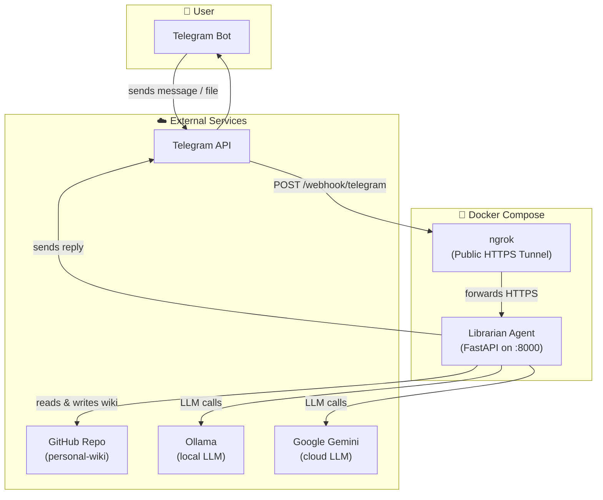
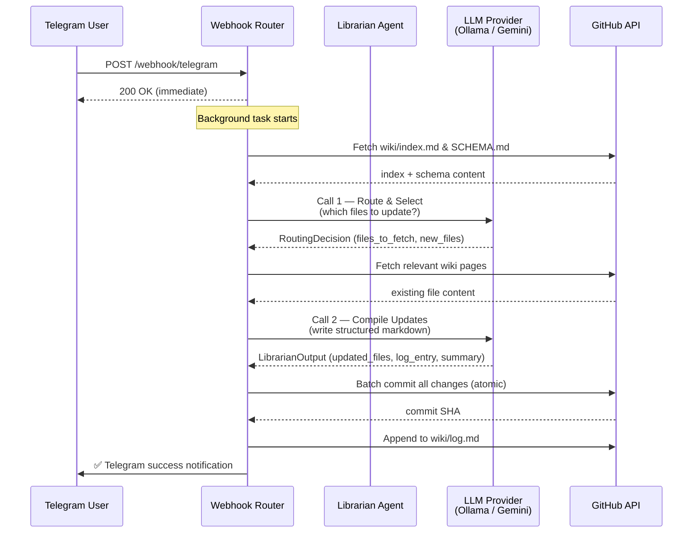
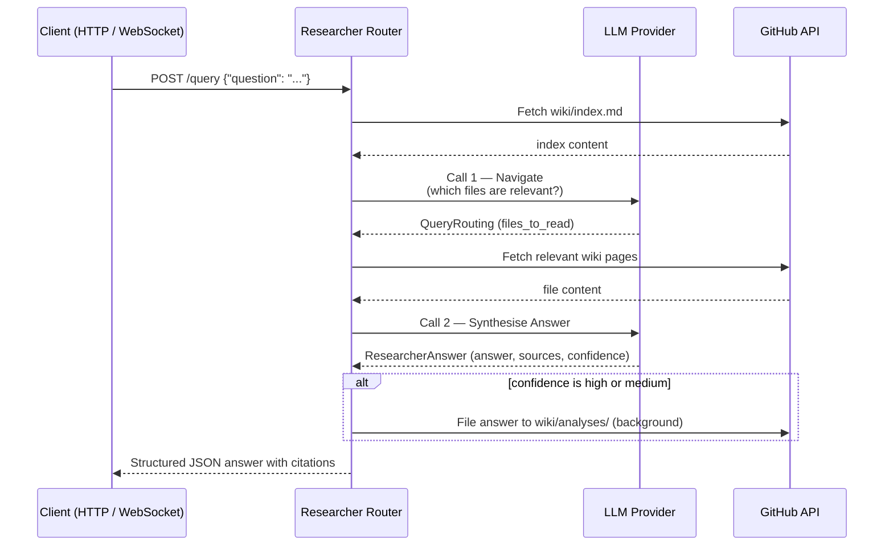

# 📚 Librarian Agent

A self-maintaining, autonomous knowledge management system that turns your Telegram messages and documents into a structured, version-controlled personal wiki on GitHub — powered by a local or cloud LLM.

---

## Overview

Librarian Agent is a **Karpathy-style LLM-wiki** pipeline. Every piece of information you send to your Telegram bot is automatically parsed, categorised, and committed to your GitHub repo as clean, structured Markdown. You can also query the wiki in natural language and get cited, grounded answers back in real time.

```
You → Telegram Message / Document
         ↓
   Librarian Agent (FastAPI)
         ↓
   LLM Routing + Compilation (Gemini or Ollama)
         ↓
   Structured Markdown Commits → GitHub Wiki Repo
```

---

## Architecture

### System Components



---

### Ingest Pipeline (Sending a message or file)

When you send text or a file to your bot, the following 8-step pipeline runs in the background:



---

### Query Pipeline (Asking a question)



---

## Features

| Feature | Description |
|---|---|
| 📥 **Text Ingest** | Send any text to your Telegram bot and it's parsed and committed to the wiki |
| 📎 **File Ingest** | Upload PDFs, `.txt`, or `.md` files — content is extracted and integrated |
| 🧠 **Two-stage LLM** | Separate routing + compilation calls keep context windows manageable |
| 🤖 **Dual LLM Support** | Switch between **Google Gemini** (cloud) and **Ollama** (local) via env var |
| 📦 **Atomic Git Commits** | All file changes land in one commit using the GitHub Git Data API |
| 🔍 **Wiki Query** | Ask questions via `POST /query` and get grounded, cited answers |
| 🌐 **Real-time WebSocket Query** | Connect to `ws://host/ws/query` for streaming status updates |
| 🗂️ **Knowledge Filing** | High/medium confidence answers are automatically filed to `wiki/analyses/` |
| 🩺 **Wiki Lint** | `POST /lint` audits `index.md` for orphan pages and ghost entries |
| 🔗 **Auto Webhook** | On every container start, the app automatically registers itself with Telegram |
| 🐳 **Dockerised** | Runs as a self-contained `docker compose up` stack with ngrok tunnelling |

---

## Wiki Structure

The GitHub wiki repository follows a strict schema enforced by `SCHEMA.md`:

```
personal-wiki/
├── wiki/
│   ├── SCHEMA.md          # Librarian operating rules (the "law")
│   ├── index.md           # Master table-of-contents (auto-maintained)
│   ├── log.md             # Append-only chronological operation log
│   ├── overview.md        # Evolving narrative synthesis of all themes
│   ├── sources/           # One page per ingested source (doc, article, CV)
│   ├── entities/          # Pages for people, orgs, tools, projects
│   ├── concepts/          # Pages for ideas, methods, frameworks
│   └── analyses/          # Filed Q&A with citations and confidence scores
└── raw_sources/           # Immutable raw dumps of every ingested source
```

---

## API Reference

| Method | Endpoint | Description |
|---|---|---|
| `POST` | `/webhook/telegram` | Telegram webhook receiver (set & forget) |
| `POST` | `/query` | Ask a question; returns structured JSON with citations |
| `WS` | `/ws/query` | Real-time query with streaming status updates |
| `POST` | `/lint` | Audit wiki/index.md for orphans and ghost entries |
| `GET` | `/health` | Liveness probe — returns service info |
| `GET` | `/docs` | Swagger UI |

---

## Tech Stack

| Layer | Technology |
|---|---|
| **API Framework** | FastAPI + Uvicorn |
| **LLM (Cloud)** | Google Gemini (via `google-genai`) |
| **LLM (Local)** | Ollama (any locally-served model, e.g. `gemma4`) |
| **GitHub Integration** | PyGithub — Git Data API for atomic commits |
| **Document Parsing** | PyMuPDF4LLM (PDF → Markdown) |
| **Telegram** | Plain HTTPS via `httpx` |
| **Tunnel** | ngrok (static domain) |
| **Containerisation** | Docker + Docker Compose |
| **Language** | Python 3.11 |

---

## Getting Started

### Prerequisites

- Docker Desktop installed and running
- A [Telegram Bot Token](https://core.telegram.org/bots#botfather) (`@BotFather`)
- A [GitHub Personal Access Token](https://github.com/settings/tokens) with `repo` scope
- An [ngrok account](https://dashboard.ngrok.com/) with a free static domain
- **Either** a Google Gemini API key **or** a locally-running Ollama instance

### 1. Clone & Configure

```bash
git clone https://github.com/<you>/librarian-agent.git
cd librarian-agent

cp .env.example .env
# Edit .env and fill in your credentials
```

### 2. Fill in `.env`

```env
# Telegram
TELEGRAM_BOT_TOKEN=your_bot_token
TELEGRAM_WEBHOOK_URL=https://your-static-domain.ngrok-free.app/webhook/telegram

# GitHub
GITHUB_TOKEN=ghp_your_token
GITHUB_REPO=owner/repo-name
GITHUB_BRANCH=main

# LLM — pick one
LLM_PROVIDER=ollama          # or "gemini"
LLM_MODEL=gemma4:latest      # or "gemini-2.5-pro"
OLLAMA_BASE_URL=http://host.docker.internal:11434

# Gemini (only needed if LLM_PROVIDER=gemini)
GEMINI_API_KEY=your_gemini_key

# ngrok
NGROK_AUTHTOKEN=your_ngrok_token
```

### 3. Bootstrap the Wiki (first time only)

```bash
python scripts/bootstrap_wiki.py
```

This creates the initial `SCHEMA.md`, `index.md`, `log.md`, and directory stubs in your GitHub repo.

### 4. Start

```bash
docker compose up --build
```

On startup, the app automatically registers the webhook with Telegram. You're done — start sending messages to your bot!

---

## Supported Input Formats

| Format | MIME Type | Notes |
|---|---|---|
| Plain text | (Telegram message) | Sent directly as text |
| `.txt` | `text/plain` | Downloaded and UTF-8 decoded |
| `.md` | `text/markdown` | Downloaded and UTF-8 decoded |
| `.pdf` | `application/pdf` | Converted to Markdown via PyMuPDF4LLM |

> **Large documents** (>40,000 chars) are first condensed into high-density fact lists before entering the main pipeline to protect the LLM's context window.

---

## Project Layout

```
wiki/
├── main.py                  # FastAPI app entry point + lifespan hook
├── config.py                # Centralised settings from environment
├── models.py                # Pydantic data models
├── requirements.txt
├── Dockerfile
├── docker-compose.yml
│
├── agents/
│   ├── librarian.py         # Ingest: routing (Call 1) + compilation (Call 2)
│   └── researcher.py        # Query: navigation (Call 1) + answer (Call 2)
│
├── routers/
│   ├── webhook.py           # POST /webhook/telegram
│   ├── query.py             # POST /query
│   ├── ws_query.py          # WS  /ws/query
│   └── lint.py              # POST /lint
│
├── services/
│   ├── github_service.py    # GitHub read/write via Git Data API
│   ├── telegram_service.py  # Send messages + set webhook
│   └── document_service.py  # PDF + text extraction + condensation
│
├── llm/
│   ├── factory.py           # Picks Gemini or Ollama based on env
│   ├── gemini.py            # Google Gemini provider
│   ├── ollama.py            # Ollama provider
│   └── base.py              # LLMProvider abstract base class
│
└── scripts/
    └── bootstrap_wiki.py    # One-time wiki initialisation script
```

---

## License

MIT — do whatever you want with it.
